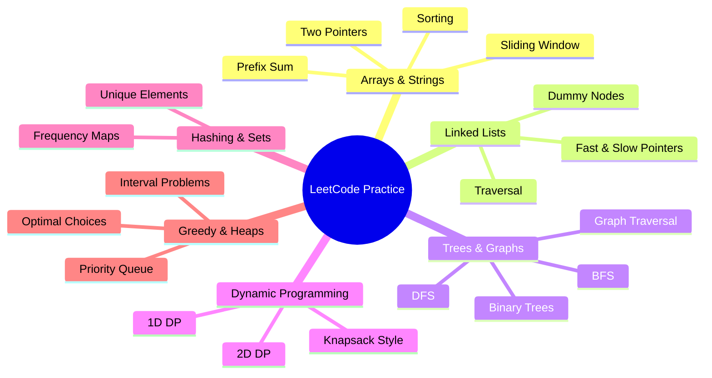

# LeetCode Solutions

A polished collection of Python solutions to a variety of LeetCode problems, designed to be easy to browse, review, and learn from. All solutions in this repository are written in Python.

## ✨ What this repository shows

- A growing set of Python solutions for different LeetCode challenges
- Files organized by problem number and title for quick navigation
- Clear implementations focused on readability and correctness
- A record of continuous practice and problem-solving progress

## 📁 Structure

Most files follow this simple naming pattern:

- ProblemNumber_ProblemName.py

Examples:

- 1_TwoSum.py
- 1345_Jump_Game_IV.py

This structure makes it easy to locate solutions by problem number or topic.

## 🎯 Purpose

This repository is meant to:

- document problem-solving approaches and techniques
- act as a personal reference for revisiting solved problems
- support learning through consistent coding practice
- build confidence for interviews and competitive programming

## 🌟 Problem Types at a Glance

This repo includes solutions across these common problem categories, including arrays, linked lists, sliding window patterns, trees, graphs, hashing, dynamic programming, and greedy strategies.
